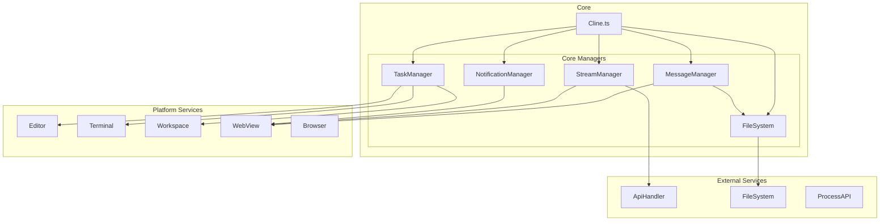
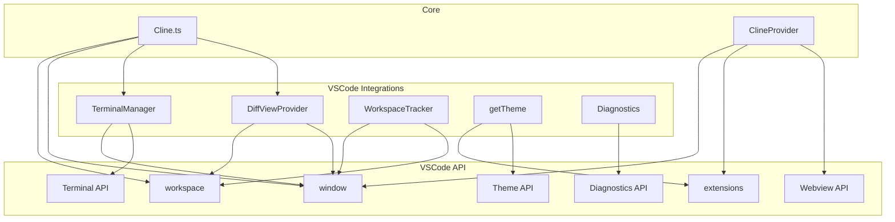
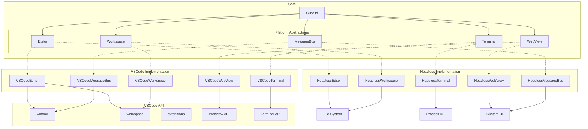

# VSCode依存関係削除計画

## 目的

現在のコードベースはVSCode拡張機能として実装されており、VSCode APIに強く依存しています。
この依存関係を取り除き、Headlessな環境でも実行可能なコードベースに再構築することが目的です。

### 期待される効果
1. プラットフォーム非依存のコアロジック
   - VSCode以外の環境でも実行可能
   - テスト容易性の向上
   - 保守性の向上

2. 明確な責務の分離
   - コアロジックとプラットフォーム固有の実装の分離
   - 新しいプラットフォームへの対応が容易に

3. Headless実行の実現
   - CI/CD環境での実行
   - サーバーサイドでの実行
   - バッチ処理での利用

## 1. 現状の依存関係の詳細分析

### Cline.tsの主な依存関係

1. **APIとモデル関連**
   - `ApiHandler`: API通信の抽象化
   - `Anthropic`: Anthropic APIとの通信
   - `OpenRouterHandler`: OpenRouter APIとの通信

2. **ファイルシステム関連**
   - `fs/promises`: ファイル操作
   - `path`: パス操作
   - `os`: OS固有の機能

3. **VSCode関連**
   - `vscode.workspace.workspaceFolders`: ワークスペース情報
   - `DiffViewProvider`: 差分表示機能
   - `TerminalManager`: ターミナル管理
   - `ClineProvider`: WebView管理

4. **ブラウザ/UI関連**
   - `UrlContentFetcher`: URL内容の取得
   - `BrowserSession`: ブラウザセッション管理

5. **ユーティリティ**
   - `delay`: 遅延処理
   - `pWaitFor`: 条件待ち
   - `serializeError`: エラーのシリアライズ
   - `cloneDeep`: ディープコピー

### コアの状態管理
```typescript
export class Cline {
  readonly taskId: string;
  api: ApiHandler;
  private terminalManager: TerminalManager;
  private urlContentFetcher: UrlContentFetcher;
  private browserSession: BrowserSession;
  private diffViewProvider: DiffViewProvider;
  private providerRef: WeakRef<ClineProvider>;
  
  // 履歴管理
  apiConversationHistory: (Anthropic.MessageParam & { ts?: number })[];
  clineMessages: ClineMessage[];
  
  // ストリーミング状態
  private currentStreamingContentIndex: number;
  private assistantMessageContent: AssistantMessageContent[];
  private userMessageContent: (Anthropic.TextBlockParam | Anthropic.ImageBlockParam)[];
}
```

これらの依存関係から、以下のインターフェースが必要になります：

1. **タスク管理**
```typescript
export interface TaskManager {
  createTask(task?: string, images?: string[]): Promise<void>;
  resumeTask(historyItem: HistoryItem): Promise<void>;
  saveTask(): Promise<void>;
}
```

2. **メッセージ管理**
```typescript
export interface MessageManager {
  addMessage(message: Message): Promise<void>;
  getHistory(): Promise<Message[]>;
  saveHistory(): Promise<void>;
}
```

3. **ストリーミング管理**
```typescript
export interface StreamManager {
  handleStream(stream: ApiStream): Promise<void>;
  processContent(content: Content): void;
  isStreaming(): boolean;
}
```

4. **ファイルシステム操作**
```typescript
export interface FileSystem {
  ensureDirectory(path: string): Promise<void>;
  readFile(path: string): Promise<string>;
  writeFile(path: string, content: string): Promise<void>;
  exists(path: string): Promise<boolean>;
}
```

5. **UI通知**
```typescript
export interface NotificationManager {
  notify(message: string, type: NotificationType): Promise<void>;
  showProgress(title: string): Promise<void>;
  hideProgress(): void;
}
```

これにより、新しい依存グラフは以下のようになります：



この新しい構造により：

1. **明確な責務の分離**
   - 各マネージャーが特定の機能を担当
   - コアロジックとプラットフォーム依存の分離
   - テスト容易性の向上

2. **柔軟な実装の切り替え**
   - 各マネージャーは独立して実装可能
   - プラットフォーム固有の実装を容易に追加可能
   - モック実装でのテストが容易

3. **状態管理の改善**
   - 各マネージャーで状態を適切に管理
   - 依存関係の方向が明確
   - 副作用の制御が容易

## 2. 抽象化レイヤーの設計

各機能を独立したインターフェースとして定義し、疎結合な構造を実現します。

### エディタ機能（`src/core/editor/`)
```typescript
export interface Editor {
  openFile(path: string): Promise<void>;
  saveFile(path: string, content: string): Promise<void>;
  showDiff(path: string, original: string, modified: string): Promise<void>;
  addDecoration(range: Range, options: DecorationOptions): void;
  scrollToLine(line: number): void;
}
```

### ターミナル機能（`src/core/terminal/`)
```typescript
export interface Terminal {
  create(cwd: string): Promise<TerminalProcess>;
  dispose(): void;
  executeCommand(command: string): Promise<CommandResult>;
  isProcessRunning(id: string): boolean;
  getOutput(id: string): string;
}
```

### ワークスペース機能（`src/core/workspace/`)
```typescript
export interface Workspace {
  getRootPath(): string;
  getRelativePath(path: string): string;
  getOpenFiles(): FileInfo[];
  getVisibleFiles(): FileInfo[];
}
```

### WebView機能（`src/core/webview/`)
```typescript
export interface WebView {
  show(): void;
  hide(): void;
  postMessage(message: any): Promise<void>;
  onMessage(callback: (message: any) => void): void;
}
```

### メッセージバス（`src/core/messagebus/`)
```typescript
export interface MessageBus {
  notify(message: string, type: 'info' | 'warning' | 'error'): Promise<void>;
  broadcast(event: string, data: any): void;
  subscribe(event: string, callback: (data: any) => void): void;
}
```

## 3. 実装手順

1. コアインターフェースの作成
   - 各機能のインターフェースを`src/core/`に定義
   - 共通の型定義を`src/core/types/`に配置
   - 各インターフェース間の依存関係を最小限に

2. VSCode実装の作成
   - `src/integrations/vscode/`に各機能のVSCode実装を作成
   ```typescript
   export class VSCodeEditor implements Editor {
     constructor(private readonly window: typeof vscode.window) {}
     // ... 実装
   }
   ```

3. Headless実装の作成
   - `src/integrations/headless/`に各機能のHeadless実装を作成
   ```typescript
   export class HeadlessEditor implements Editor {
     constructor(private readonly fs: typeof import('fs/promises')) {}

     async openFile(path: string): Promise<void> {
       // ファイルシステムを使用した実装
     }
     // ... その他の実装
   }
   ```

4. コア機能の修正
   - `Cline.ts`の依存を各インターフェースに置き換え
   ```typescript
   export class Cline {
     constructor(
       private readonly editor: Editor,
       private readonly terminal: Terminal,
       private readonly workspace: Workspace,
       private readonly webview: WebView,
       private readonly messageBus: MessageBus,
     ) {}
   }
   ```

## 4. 移行戦略

1. 段階的な移行プロセス
   a. インターフェースの準備
      - 各機能のインターフェースを定義
      - 既存の実装を参考に必要なメソッドを特定
      - テストケースの作成

   b. VSCode実装の作成
      ```typescript
      // src/integrations/vscode/editor.ts
      export class VSCodeEditor implements Editor {
        constructor(
          private readonly window: typeof vscode.window,
          private readonly workspace: typeof vscode.workspace,
        ) {}

        async openFile(path: string): Promise<void> {
          // 既存の実装をラップ
        }
        // ... その他の実装
      }
      ```

   c. Headless実装の作成
      ```typescript
      // src/integrations/headless/editor.ts
      export class HeadlessEditor implements Editor {
        constructor(private readonly fs: typeof import('fs/promises')) {}

        async openFile(path: string): Promise<void> {
          // ファイルシステムを使用した実装
        }
        // ... その他の実装
      }
      ```

   d. 段階的な機能移行
      1. エディタ機能
      2. ターミナル機能
      3. ワークスペース機能
      4. WebView機能
      5. メッセージング機能

2. 並行運用とテスト
   - 各機能の新旧実装を並行運用
   - ユニットテストでの動作確認
   - 段階的な切り替え

3. 安全な移行のためのチェックポイント
   - 各インターフェースの実装完了時
   - テストケースの作成完了時
   - 新旧実装の並行動作確認時
   - 完全移行時

## 5. 優先順位

1. フェーズ1: 基本設計（2週間）
   - 各機能のインターフェース設計
   - 型定義の整備
   - テストケースの設計

2. フェーズ2: コア機能（3週間）
   - エディタ機能の実装
   - ターミナル機能の実装
   - ワークスペース機能の実装

3. フェーズ3: UI機能（2週間）
   - WebView機能の実装
   - メッセージバスの実装
   - UI関連機能の移行

4. フェーズ4: 統合とテスト（1週間）
   - 機能の統合
   - E2Eテストの作成
   - パフォーマンステスト

## 6. 詳細設計

### ディレクトリ構造
```
src/
├── core/                     # コア機能
│   ├── platform/            # プラットフォーム抽象化
│   │   ├── types.ts         # 共通型定義
│   │   ├── editor.ts        # エディタインターフェース
│   │   ├── terminal.ts      # ターミナルインターフェース
│   │   ├── workspace.ts     # ワークスペースインターフェース
│   │   └── index.ts         # プラットフォーム抽象化のエントリーポイント
│   ├── assistant-message/   # 既存: アシスタントメッセージ処理
│   ├── diff/               # 既存: 差分処理
│   ├── prompts/            # 既存: プロンプト管理
│   ├── webview/            # 既存: Webview関連
│   ├── config/             # 既存: 設定管理
│   ├── Cline.ts           # メインのコアロジック
│   └── index.ts           # コアモジュールのエントリーポイント
├── integrations/
│   └── vscode/            # VSCode実装
│       ├── platform/      # VSCodeプラットフォーム実装
│       │   ├── editor.ts   # VSCodeエディタ実装
│       │   ├── terminal.ts # VSCodeターミナル実装
│       │   ├── workspace.ts # VSCodeワークスペース実装
│       │   └── index.ts    # VSCode実装のエントリーポイント
│       └── extension.ts   # VSCode拡張のエントリーポイント
└── shared/               # 共有ユーティリティ
    ├── array.ts         # 既存
    ├── api.ts          # 既存
    └── types.ts        # 共通型定義
```

### プラットフォームインターフェース（`src/core/platform/index.ts`）
```typescript
import { Editor } from './editor';
import { Terminal } from './terminal';
import { Workspace } from './workspace';

export interface Platform {
  editor: Editor;
  terminal: Terminal;
  workspace: Workspace;

  showMessage(message: string, type: 'info' | 'warning' | 'error'): Promise<void>;
  openExternal(url: string): Promise<void>;
  getConfiguration(): Promise<Record<string, unknown>>;
}

export * from './types';
export * from './editor';
export * from './terminal';
export * from './workspace';
```

### エディタインターフェース（`src/core/platform/editor.ts`）
```typescript
import { Range, DecorationOptions } from './types';

export interface Editor {
  openFile(path: string): Promise<void>;
  saveFile(path: string, content: string): Promise<void>;
  showDiff(path: string, original: string, modified: string): Promise<void>;
  addDecoration(range: Range, options: DecorationOptions): void;
  scrollToLine(line: number): void;
}
```

### ターミナルインターフェース（`src/core/platform/terminal.ts`）
```typescript
import { CommandResult, TerminalProcess } from './types';

export interface Terminal {
  create(cwd: string): Promise<TerminalProcess>;
  dispose(): void;
  executeCommand(command: string): Promise<CommandResult>;
  isProcessRunning(id: string): boolean;
  getOutput(id: string): string;
}
```

### ワークスペースインターフェース（`src/core/platform/workspace.ts`）
```typescript
import { FileInfo } from './types';

export interface Workspace {
  getRootPath(): string;
  getRelativePath(path: string): string;
  getOpenFiles(): FileInfo[];
  getVisibleFiles(): FileInfo[];
}
```

### 共通型定義（`src/core/platform/types.ts`）
```typescript
export interface Range {
  start: { line: number; character: number };
  end: { line: number; character: number };
}

export interface DecorationOptions {
  backgroundColor?: string;
  color?: string;
  isWholeLine?: boolean;
}

export interface FileInfo {
  path: string;
  type: 'file' | 'directory';
  size?: number;
  lastModified?: Date;
}

export interface CommandResult {
  output: string;
  exitCode: number;
  error?: string;
}

export interface TerminalProcess {
  id: string;
  isRunning: boolean;
  lastCommand?: string;
  on(event: 'data' | 'exit', callback: (data: any) => void): void;
}
```

## 7. 依存関係の変更

### 現在の依存グラフ


### 移行後の依存グラフ


この変更により：

1. **分散された依存関係**
   - 各機能が独立したインターフェースとして定義
   - `Platform`インターフェースを廃止し、個別の抽象化を採用
   - 機能間の疎結合を実現

2. **新しい構造のメリット**
   - 必要な機能のみを使用可能
   - 機能ごとの独立したテストが容易
   - 実装の差し替えが容易
   - 新機能の追加が容易

3. **コンストラクタインジェクション例**
```typescript
export class Cline {
  constructor(
    private readonly editor: Editor,
    private readonly terminal: Terminal,
    private readonly workspace: Workspace,
    private readonly webview: WebView,
    private readonly messageBus: MessageBus,
  ) {}
}
```

4. **メッセージバスの追加**
   - UI通知やイベント処理を担当
   - プラットフォーム固有のメッセージング実装を抽象化
   - コンポーネント間の通信を統一的に処理
```